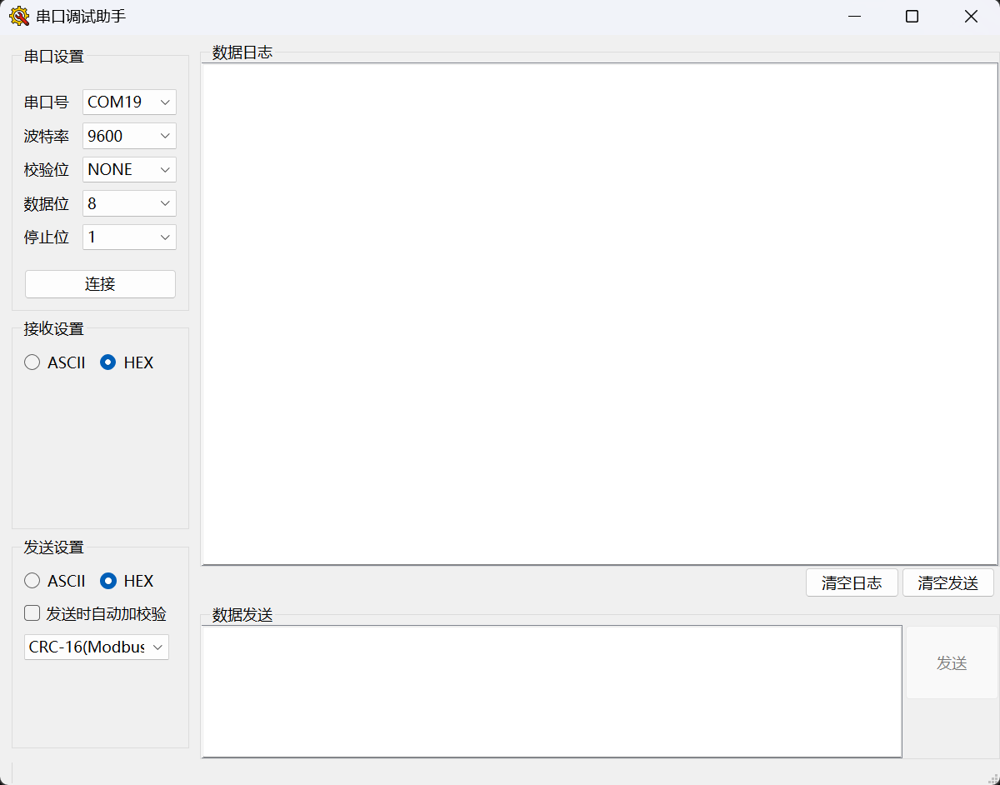
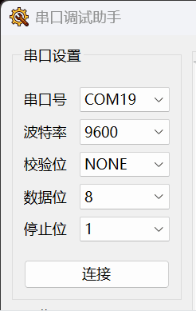
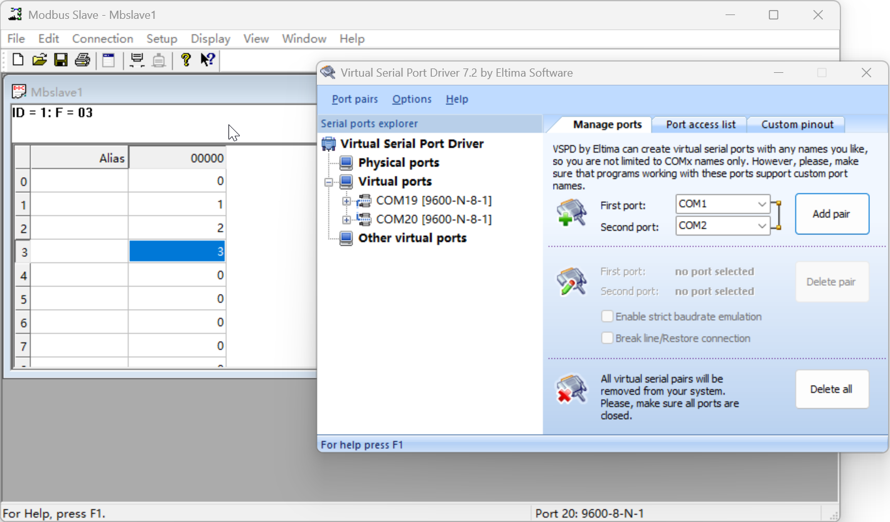
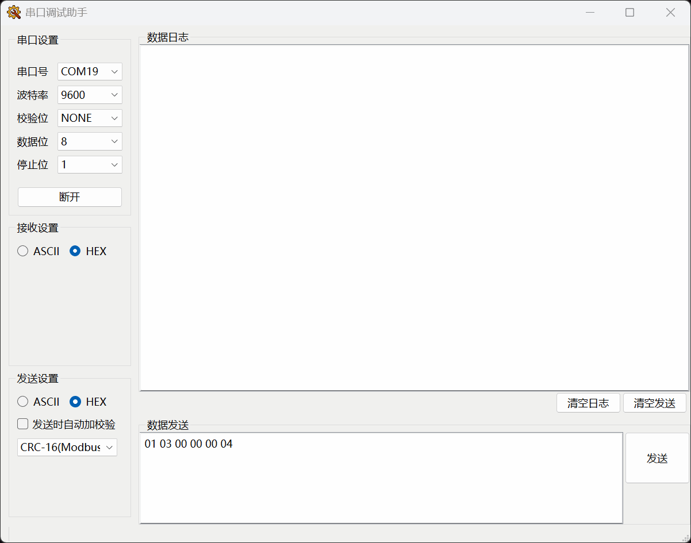

# 使用说明

[TOC]

## 作者

https://github.com/Aphrora1917/SerialPortAssist/settings


## 介绍

该软件为作者学习串口通信而编写，采用C++\Qt，串口库调用QSerialPort和QSerialPortInfo

Qt版本：6.7.0

主要功能是收发串口的Uart数据，具体包括：

1. 串口参数设置
2. 串口连接与断开
3. 收发格式设置ASCII与HEX
4. HEX模式发送时可追加CRC-16与CRC-32校验值
5. 发送与接收日志显示




## 串口设置




## 发送测试

* 测试协议：Modbus
* 测试环境：VSPD + Mdbus Slave

**VSPD 和 Modbus Slave 配置：**




**发送实况：**




## 测试数据

测试数据为**ModBus RTU 请求帧**

- **原始字节流** (16进制):

  ```
  01 03 00 00 00 04 44 09
  ```

  **结构分析**:

  - `01`: 从站地址
  - `03`: 功能码 (读保持寄存器)
  - `00 00`: 起始地址高/低字节
  - `00 04`: 寄存器数量高/低字节
  - `44 09`: **CRC-16** 校验码 (低字节在前)

* **Modbus响应帧**

  ```
  01 03 08 00 00 00 01 00 02 00 03 49 D6
  ```

  **结构分析**:

  * `01`: 从站地址
  * `03`: 功能码 (读保持寄存器)
  * `08: 随后数据部分的字节个数
  * `00 00`: 第一个寄存器的值
  * `00 01`: 第二个寄存器的值
  * `00 02`: 第三个寄存器的值
  * `00 03`: 第三个寄存器的值
  * `49 D6`: **CRC-16** 校验码 


ps：ASCII模式作者还不知道调试场景，所以先不测

